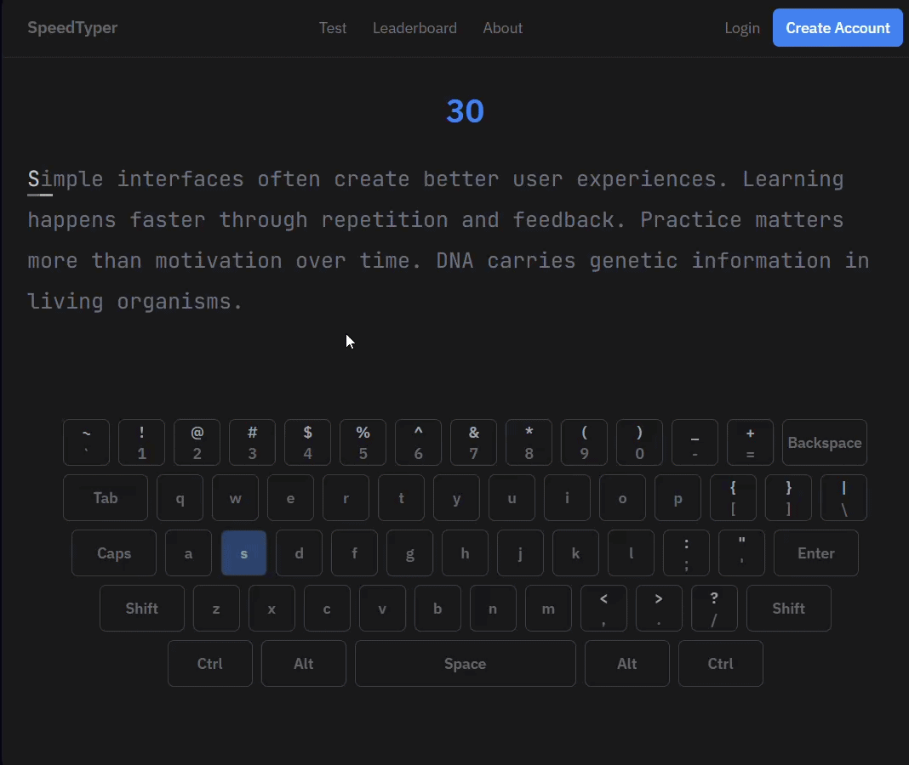

# Speed Typer

A browser-based typing speed test that lets users practice typing through timed
sessions while tracking typing speed, accuracy, key activity, and performance
over time.

## Why I Built This

I wanted to build a typing application that was more than just a simple
"WPM calculator."

The goal was to explore how real-time keyboard input could be captured,
processed, and turned into useful feedback such as typing metrics, performance
history, and a keyboard heatmap.

It was also a way to practice building an interactive application where the
typing engine and session state are separated from the UI.

## Features

- Timed typing sessions
- 15, 30, and 60-second durations
- Word typing mode
- Number typing mode
- Real-time WPM calculation
- Typing accuracy tracking
- Performance history during a session
- Live keyboard visualization
- Keyboard heatmap after each session
- Typing sound effects
- Session restart
- Keyboard event tracking
- Typing session replay system

## Screenshots



## Tech Stack

### Frontend

- React
- TypeScript
- Vite
- Tailwind CSS

## Architecture

The application separates the typing session engine from the individual
features that consume the typing data.

```text
User
  │
  ▼
Typing Interface
  │
  ▼
Typing Session
  │
  ├── Keyboard Events
  │
  ├── Timer
  │
  ├── Typed Characters
  │
  └── Session State
         │
         ├───────────────┐
         ▼               ▼
   Typing Metrics    Keyboard Heatmap
         │               │
         ▼               ▼
      Metrics         Keyboard
         │
         ▼
   Performance History
```

## How It Works

1. User selects a test duration.
2. User selects a typing mode.
3. The application generates the text for the selected mode.
4. The typing session starts when the user begins typing.
5. Keyboard events are recorded throughout the session.
6. The application tracks the user's typed characters and current position.
7. Typing metrics are calculated from the recorded keyboard events.
8. The timer ends when the selected duration is reached.
9. The recorded events are used to generate performance history.
10. Keyboard events are also processed into a keyboard heatmap.
11. The results screen displays the user's typing performance.

## Typing Modes

### Words

The default typing mode displays words for the user to type.

```text
The quick brown fox jumps over the lazy dog
```

## Typing Metrics

The application calculates several metrics from the recorded keyboard events.

### WPM

Words per minute is calculated from the user's typing activity and the elapsed
time of the session.

### Accuracy

Accuracy measures how many of the user's keystrokes match the expected text.

### Performance History

Instead of only calculating the final result, the application generates a
history of typing performance throughout the session.

This allows the results screen to show how typing speed changed while the user
was typing.

## Keyboard Visualization

The application includes an interactive keyboard that provides feedback about
the user's typing activity.

During a typing session, the keyboard operates in **live mode** and highlights
the user's latest input.

After the session ends, it switches to **heatmap mode**.

The heatmap uses the recorded keyboard events to show which keys were used most
frequently during the session.

```text
┌─────────────────────────────────────────────┐
│ Q  W  E  R  T  Y  U  I  O  P              │
│  A  S  D  F  G  H  J  K  L                 │
│    Z  X  C  V  B  N  M                     │
└─────────────────────────────────────────────┘
```

## Session Engine

Typing sessions are managed separately from the UI.

The session keeps track of information such as:

```ts
{
    ;(currentIndex,
        typed,
        keyEvents,
        words,
        lastInput,
        remainingTime,
        duration,
        isTyping,
        isResults)
}
```

This allows different parts of the application to consume the same session
data.

For example, the recorded `keyEvents` are used by both the typing metrics and
keyboard heatmap.

```text
                 keyEvents
                    │
        ┌───────────┴───────────┐
        ▼                       ▼
calculateTypingMetrics   calculateKeyboardHeatmap
        │                       │
        ▼                       ▼
     WPM / Accuracy        Keyboard Heatmap
        │
        ▼
generateMetricHistory
        │
        ▼
 Performance Graph
```

## Getting Started

### Prerequisites

- Node.js
- npm

### Installation

Clone the repository:

```bash
git clone <your-repository-url>
cd speed-typer
```

Install dependencies:

```bash
npm install
```

## Future Improvements

- [ ] Number typing mode
- [ ] Quote typing mode
- [ ] Symbols typing mode
- [ ] Add custom text
- [ ] Add user accounts
- [ ] Save typing history
- [ ] Add personal best records
- [ ] Add global leaderboards
- [ ] Improve session replay controls
- [ ] Add more detailed keyboard analytics
